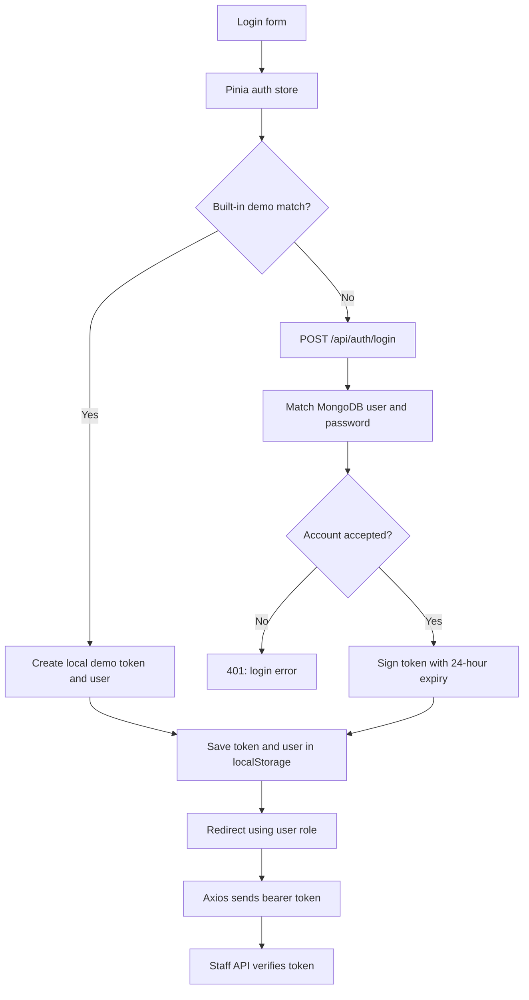

<div align="center">

# 🅿️ MFU Parking Management System

**A web portal for parking operations at Mae Fah Luang University**

Vue 3 · TypeScript · Pinia · Node.js · MongoDB

[Getting started](#getting-started) · [Authentication](#authentication) · [Project structure](#project-structure) · [Documentation](#documentation)

</div>

---

## Overview

MFU Parking Management System brings parking availability, CCTV access, vehicle logs, and staff workflows into one web interface. The repository contains a Vue frontend, a Node.js API backed by MongoDB, and an optional Python CCTV viewer.

ระบบจัดการลานจอดรถสำหรับมหาวิทยาลัยแม่ฟ้าหลวง รวมหน้าจอสำหรับเจ้าหน้าที่และผู้ดูแลระบบ การตรวจสอบช่องจอด กล้อง CCTV และประวัติการเข้า–ออกของรถ

> **Development status:** This is a development prototype with demo authentication and incomplete access controls. The behavior below is based on the current source code. Review [current limitations](#current-limitations) before using real accounts or exposing the API.

## Features and implementation status

| Area | Current implementation |
| --- | --- |
| Login | Shared admin/staff login page; local demo accounts and database login |
| Parking dashboard | Slot totals and availability, filtered by building, floor, and vehicle type |
| Parking operations | Slot status updates and staff change history |
| Vehicle records | Parking logs and resource APIs for vehicles and related records |
| CCTV | Camera listings, stream metadata, and FFmpeg snapshot/MJPEG proxy |
| Administration | Admin dashboard and generic database CRUD endpoints |
| Staff profile | Profile lookup and password/PIN updates; assigned area currently fixed to E4, floor 4 |
| Chat | Frontend components and service calls exist; backend returns HTTP 501 because persistence is not implemented |

## Technology

| Layer | Tools |
| --- | --- |
| Frontend | Vue 3, TypeScript, Vite, Vue Router, Pinia |
| Interface | Tailwind CSS, PrimeVue, Lucide icons |
| HTTP client | Axios with a bearer-token request interceptor |
| API | Node.js built-in `http` server; routing and authentication in `src/server.js` |
| Database | MongoDB with Mongoose |
| Camera media | FFmpeg for the web API; Python/OpenCV for the optional desktop viewer |
| Development checks | Vue type checking, Vitest, Playwright, ESLint, Oxlint |

## Getting started

### Prerequisites

- Node.js **22.12 or newer** and npm; Node.js 24 is a suitable development choice.
- A running MongoDB instance.
- FFmpeg on the backend machine if you need CCTV snapshots or MJPEG streams.
- Access to the camera network for live CCTV. Camera viewing is optional for starting the web app.

### 1. Clone the repository

```bash
git clone https://github.com/ptk007/parking_management_system.git
cd parking_management_system
```

### 2. Start the API

```bash
cd parking-backend
npm ci
cp .env.example .env
```

On Windows Command Prompt, use `copy .env.example .env` instead of `cp`.

Edit `parking-backend/.env` for your local environment:

```dotenv
PORT=3000
MONGODB_URI=mongodb://127.0.0.1:27017/parking_management_system
FRONTEND_ORIGIN=http://localhost:5173
TOKEN_SECRET=replace-with-a-random-local-secret
ALLOW_DEMO_AUTH=false
```

Generate a secret locally with `node -e "console.log(require('crypto').randomBytes(32).toString('hex'))"` and use the output as `TOKEN_SECRET`.

```bash
npm start
```

The API connects to MongoDB, creates indexes, and imports the bundled CCTV JSON files into their corresponding collections only when those collections are empty. It does **not** automatically create login accounts or populate parking slots and logs. Use a disposable local database and synthetic data for development.

Health endpoint: `http://localhost:3000/health`.

### 3. Start the frontend

In another terminal, from the repository root:

```bash
cd parking-front
npm ci
```

Create `parking-front/.env.development.local`:

```dotenv
VITE_API_BASE_URL=http://localhost:3000/api
```

```bash
npm run dev
```

Open the URL printed by Vite, normally `http://localhost:5173`. Keep `FRONTEND_ORIGIN` aligned with the actual frontend origin.

### 4. Choose a login path

- **UI demo:** The login page displays the built-in demo accounts. The frontend accepts them locally even with no backend running. Data operations still need the API. The suggested configuration above rejects demo tokens at the backend; enabling `ALLOW_DEMO_AUTH=true` is for isolated local demonstrations only and does not make every demo operation work.
- **Database login:** Use a separately provisioned test account in the `users` collection whose username is different from the built-in demo accounts. The current implementation compares the stored password directly. Database roles are numeric: `1` = user, `2` = staff, `3` = admin; status `3` disables login. There is no dedicated registration or user-seeding command.

### Configuration reference

| Variable | Location | Purpose |
| --- | --- | --- |
| `VITE_API_BASE_URL` | Frontend | API base URL; development default is `http://localhost:3000/api` |
| `PORT` | Backend | HTTP port; default `3000` |
| `MONGODB_URI` | Backend | MongoDB connection string |
| `FRONTEND_ORIGIN` | Backend | Origin allowed by CORS; default `http://localhost:5173` |
| `TOKEN_SECRET` | Backend | HMAC signing key; replace the source fallback |
| `ALLOW_DEMO_AUTH` | Backend | Demo-token acceptance; only the literal value `false` disables it |
| `FFMPEG_PATH` | Backend | FFmpeg executable; default `ffmpeg` |
| `CCTV_RTSP_USERNAME`, `CCTV_RTSP_PASSWORD`, `CCTV_RTSP_PATH` | Backend | Fallback RTSP connection settings; use authorized local configuration |
| `CCTV_MEDIA_TIMEOUT_MS` | Backend | Initial camera-media timeout; default `15000` ms |

Never put secrets in `VITE_*` variables: those values are exposed in the frontend build. For a deployment build, override the placeholder API URL in `.env.production` using `.env.production.local`. Building the frontend does not resolve the authentication limitations described below.

## Authentication

### Components

| Component | Responsibility |
| --- | --- |
| [`src/views/staff/LoginView.vue`](parking-front/src/views/staff/LoginView.vue) | Active login form; calls the store and routes admins to `/admin/dashboard`, other roles to `/dashboard` |
| [`src/stores/auth.ts`](parking-front/src/stores/auth.ts) | Checks demo accounts first; otherwise calls the API; stores user/token; clears local state on logout |
| [`src/services/api.ts`](parking-front/src/services/api.ts) | Axios client, auth endpoints, bearer header, and token-bearing CCTV URLs |
| [`src/App.vue`](parking-front/src/App.vue) | Restores local storage on mount and redirects when no token is present |
| [`src/router/index.ts`](parking-front/src/router/index.ts) | Declares routes; currently has no global authentication or role guard |
| [`src/server.js`](parking-backend/src/server.js) | User schema, login/logout/verify handlers, token signing/verification, staff API and resource routing |

The separate `parking-front/src/views/LoginView.vue` exists, but the router imports the login view under `views/staff/`.

### Login and request flow



For database login, `handleAuth()` uses this lookup:

```js
const user = await User.findOne({
  username: body.username,
  password: body.password,
  status: { $ne: 3 },
})
```

A successful login sets status to `1` (online) and returns `{ token, user }`. `userDto()` omits the password and PIN and converts the numeric role into its frontend label. The form password is sent as JSON; the auth store persists the returned user and token, not the submitted password.

### Credentials and tokens

| Item | Actual handling |
| --- | --- |
| Account password and PIN | String fields in MongoDB. Password login uses direct equality; profile updates write supplied password/PIN values without hashing. PIN is not checked during login. |
| API token format | Custom two-part `base64url(payload).HMAC-SHA256-signature`; not a standard three-part JWT. Payload includes `id`, `username`, numeric `role`, and a millisecond `exp` timestamp. Signing does not encrypt the payload. |
| API token verification | Checks the HMAC using `timingSafeEqual` after a length check, then checks expiry. Normal tokens expire 24 hours after issuance. |
| Browser persistence | `token` and serialized `user` are saved in `localStorage` and copied into Pinia state. They are readable and editable by browser JavaScript. No HttpOnly cookie session is implemented. |
| API requests | Axios reads `localStorage.token` and sets `Authorization: Bearer <token>`. The interceptor is shared across the API client. |
| CCTV media requests | `getMediaUrl()` adds `?token=...`; `handleStaff()` accepts a query token when no header token is present. Token-bearing URLs can appear in logs. |
| Demo tokens | Frontend creates `demo_token_<timestamp>`. If demo auth is enabled, backend accepts any token matching that pattern as a synthetic staff identity with ID `demo`; the timestamp is not validated as an expiry. |
| Refresh and revocation | No refresh-token mechanism or token revocation list is implemented. |

### Verification, restoration, and logout

| Endpoint or action | Behavior |
| --- | --- |
| `POST /api/auth/login` | Accepts `{ username, password }`; returns token/user or HTTP 401 |
| `GET /api/auth/verify` | Requires a header token; looks up the user and returns `{ valid, user }`. A missing user can produce HTTP 200 with `valid: false`. |
| App initialization | Restores local storage and considers any nonempty token authenticated. It does not call the verification endpoint. |
| Store `verifyToken()` | Checks HTTP status 200 only, without inspecting the response's `valid` field; it is not wired into app initialization. |
| `POST /api/auth/logout` | Requires a header token and sets the database user's status to offline. It does not revoke the token. |
| Local logout cleanup | Clears Pinia and both local-storage keys in `finally`, even if the API call fails |

Demo tokens have no MongoDB user ObjectId. Handlers that look up that identity, including verification, logout, and profile operations, can fail. A demo admin role in the browser is also not preserved by backend demo verification, which always returns role `2`.

### Current limitations

These are implementation gaps, not guarantees provided by the application:

- **Generic resource APIs have no authentication check.** `requestHandler()` routes endpoints such as `/api/users` directly to `handleResource()`. They can read or modify records without a token, and user reads return raw documents including password/PIN fields.
- **Staff APIs verify tokens but do not enforce roles or current account status.** A signed role claim and frontend role-based navigation do not provide server-side authorization. Disabling an account after login does not by itself invalidate an issued token.
- **Password hashing is not implemented.** Add password hashing and input validation before using real credentials.
- **Demo bypass is enabled by default on the backend.** Set `ALLOW_DEMO_AUTH=false` and remove or gate the frontend demo branch before deployment.
- **Browser token presence is trusted for navigation.** Add route guards, server verification on restoration, and expired-token handling; server authorization is still required independently.
- **Logout does not revoke issued tokens.** A copied token remains usable until expiry under the current verifier.
- **Camera credentials need protection.** Source contains fallback RTSP credentials, and camera DTOs/stream responses can include credential-bearing source URLs. Keep credentials server-side, redact responses, and rotate any real credentials that have been committed. Do not publish real camera inventories as sample data.

Older [login documentation](docs/md_file/main/LOGIN_PAGE.md) describes bcrypt, JWT/session handling, and role checks as though implemented. The [API integration guide](parking-front/API_INTEGRATION.md) also contains illustrative responses. Use this README and the linked source for current behavior; those older documents are design references where they disagree.

## Project structure

| Path | Contents |
| --- | --- |
| [`parking-front/`](parking-front/) | Vue application, views, components, stores, API services, and frontend guides |
| [`parking-backend/`](parking-backend/) | Node.js server, MongoDB models, environment example, and camera seed data |
| [`python/`](python/) | Optional Windows-oriented Python RTSP viewer and setup scripts |
| [`cctv/`](cctv/) | Camera inventory assets; review sensitive data before sharing |
| [`docs/`](docs/) | Proposal, UI design references, database examples, and feature notes |

## Development commands

Run these from the indicated directory:

| Directory | Command | Purpose |
| --- | --- | --- |
| `parking-front` | `npm run dev` | Start Vite development server |
| `parking-front` | `npm run build` | Type-check and build frontend |
| `parking-front` | `npm run preview` | Preview the frontend build locally |
| `parking-front` | `npm run type-check` | Check Vue/TypeScript types |
| `parking-front` | `npm run test:unit -- --run` | Run Vitest once |
| `parking-front` | `npm run test:e2e` | Run Playwright tests; browser installation may be required |
| `parking-front` | `npm run lint` | Run configured linters with automatic fixes |
| `parking-backend` | `npm start` | Start API server |
| `parking-backend` | `npm test` | JavaScript syntax check only; not an authentication or integration test suite |

## Documentation

- [Frontend tooling and commands](parking-front/README.md)
- [Frontend setup guide](parking-front/SETUP.md)
- [API integration reference](parking-front/API_INTEGRATION.md)
- [Original login design](docs/md_file/main/LOGIN_PAGE.md)
- [Python CCTV viewer](python/README.md)
- [UI design references](docs/UI/)

## Contributing

Keep changes focused and open a pull request explaining the problem, resulting behavior, and checks performed. Use synthetic test accounts and camera data. Update the documentation when API contracts or authentication behavior change.

## License

No repository-wide `LICENSE` file is currently included. The backend package metadata declares ISC, but this does not establish a clear license for every asset in the repository.
